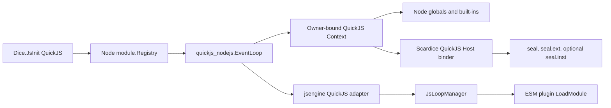

# QuickJS Node.js Runtime Integration Design

**Status:** Approved for implementation planning; environment policy superseded by `2026-08-30-quickjs-plugin-safety-design.md`  
**Date:** 2026-08-30

## Goal

Replace Scardice's experimental QuickJS owner loop with `github.com/Scardice/quickjs_nodejs` while preserving Scardice's existing `seal` Host API semantics. QuickJS plugin entry files become ESM. The integration adds explicit Node-compatible built-ins without weakening existing filesystem isolation.

Goja remains the default engine and its runtime, CommonJS loader, and native-module path are unchanged.

## Decisions

| Area | Decision |
| --- | --- |
| Runtime owner | One `quickjs_nodejs/eventloop.EventLoop` owns each QuickJS runtime/context. The existing Scardice `runtimeLoop` does not coexist with it. |
| Plugin entry format | QuickJS `.js` files and compiled `.ts` outputs execute through `Context.LoadModule` as ESM. |
| ESM filesystem loading | Disabled with `eventloop.WithModuleImport(false)`. ESM may import registry-provided built-ins, including dynamically, but path-backed imports must fail. |
| CommonJS | The bootstrap explicitly calls `registry.EnableRequire(ctx)`. It resolves registered built-ins only; path-backed CommonJS require must fail. It does not make CommonJS the entry execution model. |
| Host binding | Keep Scardice's custom QuickJS binder. Do not use qnode `Context.Bind`, because it uses `js`/`json` tags and marshal copies rather than `jsbind`, live host-object identity, callback conversion, and map/slice proxying. |
| Environment | `process.env` receives the explicit non-secret initialization snapshot defined by `2026-08-30-quickjs-plugin-safety-design.md`. |
| Reload | Preserve Scardice's existing close-and-recreate `JsReload` lifecycle. qnode's in-place `Reload` is not called by Scardice. |
| Network policy | Preserve current behavior. Fetch adapts the existing `goproxy` handler; WebSocket remains available through an explicit qnode dialer/policy. No new permissions model is introduced. |

## Runtime Architecture



`utils/jsengine/quickjs` becomes an adapter around qnode's event loop. `jsengine.Loop.Run` delegates to the qnode `ContextTask` operation: it synchronously runs on the owner goroutine whether the event loop is already pumping or not, and runs directly for a re-entrant owner callback.

The adapter keeps its existing raw-context registration used by `host.go`. It continues to own Scardice callback stores and host-object identity tables. Before qnode closes its context, the adapter clears those Scardice stores and removes the raw-context mapping.

After all globals and Host APIs are installed, the qnode event loop starts continuous pumping. This processes QuickJS Promise jobs, JavaScript timers, fetch completions, and WebSocket events while preserving serialized context access.

## Module Model

### Built-ins

Create one qnode `module.Registry` for each QuickJS runtime. Register these definitions explicitly:

- `buffer`
- `console` using `Dice.JsPrinter`
- `process` using the initialization-time environment snapshot
- `url`
- `util`
- `crypto`
- `fetch`
- `websocket`
- `abort`
- `structuredclone`

Their qnode-provided `node:` and `@seal/*` aliases are registered through the same registry. ESM and explicit CJS require therefore resolve one registry rather than independent module implementations.

### Filesystem module

Scardice's existing Goja-only `fs` implementation is not reusable. Implement the same API for QuickJS as an explicit qnode native CommonJS module and global `fs` object. It must preserve:

- `data://` per-extension storage mapping;
- canonical parent/target containment checks;
- symlink escape checks;
- the existing `AllowFilesystemUnrestrictedAccess` behavior;
- synchronous and Promise-returning operations.

The filesystem module is distinct from plugin source loading. Accessing a plugin's source is not permission to access its data storage, or vice versa.

### CommonJS compatibility

`registry.EnableRequire(ctx)` exposes only the registry's in-memory definitions and explicit native modules. `require("fs")`, `require("crypto")`, and `require("@seal/http")` are valid; `require("./helper")`, absolute paths, `node_modules`, and package directories must fail.

Do not configure `module.WithSourceLoader`, `module.WithPathResolver`, `module.WithBaseDir`, or `module.WithGlobalFolders`. A global `require` cannot discover which of several ESM entries called it, so path-backed CommonJS resolution would associate the wrong plugin root.

### ESM source loading

`WithModuleImport(false)` is mandatory. `Context.LoadModule` receives the already-read plugin entry source, and the registry provides in-memory ESM built-ins. Consequently these work:

```js
import { Buffer } from "buffer";
import { subtle } from "@seal/crypto";
const util = await import("util");
```

These must fail during the first integration:

```js
import "./helper.js";
import "/host/path/module.js";
```

A future controlled ESM source loader requires an upstream qnode/quickjs-go extension; it is out of scope here.

## Initialization and Reload Flow

1. `Dice.jsInitQuickJS` calls existing `jsClear`, closing any active engine loop through `JsLoopManager`.
2. It creates the qnode registry with all built-ins and no path-backed CommonJS source loader.
3. It creates qnode `EventLoop` with `WithModuleImport(false)`, the registry, and required global installers.
4. It registers the adapter in `JsLoopManager` to allocate the Scardice generation, then in a synchronous owner `ContextTask` it enables `require`, installs the existing Scardice Host API, extension API, dangerous `seal.inst` proxy where configured, and the remaining globals.
5. On success it enables JS, then starts continuous qnode pumping. A Host-bootstrap or start failure calls `SetEngineLoop(nil)` before disabling QuickJS.
6. `JsLoadScriptRaw` runs QuickJS entries as ESM. Existing TypeScript compilation remains the input preparation step.
7. `JsReload` retains its current cron, registry, wrapper, and configuration sequence. `SetEngineLoop(nil)` closes the qnode loop, which closes registered fetch/WebSocket resources, clears timers and module context state, and destroys the raw context. The subsequent initialization creates and binds an entirely new runtime.

`JsLoopManager.version` continues to reject callbacks bound to a previous Scardice JS generation. qnode's context generation protects queued timers and resources inside its event loop.

## Error Handling

- A failed qnode creation or Host installation disables QuickJS through the existing `disableQuickJS` path.
- ESM parse, evaluation, or forbidden-import failures populate `JsScriptInfo.ErrText`, disable only that script, and preserve the process-wide QuickJS realm for other scripts.
- Path-backed CommonJS requires fail without any fallback to direct filesystem reads.
- Fetch/WebSocket resources register with the qnode event loop. Close or reload releases them before destroying their QuickJS context.
- No `quickjs.Value`, Promise, Function, or object crosses the qnode owner goroutine or a runtime-generation boundary.

## Dependency Coordination

`quickjs_nodejs` currently declares `github.com/buke/quickjs-go v0.7.6`, while Scardice resolves `v0.7.7`. Before Scardice adds the qnode dependency, qnode must update to `v0.7.7` and re-run its complete test, vet, and race suites. The integration must depend on a published/committed qnode revision; a local development `replace` directive must not be committed to Scardice.

## Verification Contract

### qnode prerequisite

At the `quickjs-go v0.7.7` revision:

```text
go test ./... -count=1 -timeout=240s
go vet ./...
go test -race ./... -count=1 -timeout=300s
```

### Scardice coverage

Add or update tests that prove:

1. The QuickJS adapter preserves existing `jsbind` filtering, Go callback invocation, and dangerous API mutation of nested struct/map/slice values.
2. A QuickJS ESM plugin statically imports a built-in, dynamically imports another built-in, and registers an extension through `seal.ext.register`.
3. ESM path imports fail with `WithModuleImport(false)`.
4. Explicit `require` resolves registered built-ins and rejects every path-backed specifier.
5. `process.env` is the initialization-time snapshot.
6. Fetch reaches an existing proxy-backed test handler.
7. Closing or reloading invalidates old callbacks and does not allow a resource completion to touch the old realm.
8. Goja tests remain green and receive no behavior change.

Run affected unit/integration tests during implementation, then:

```text
go test ./...
go vet ./...
```
